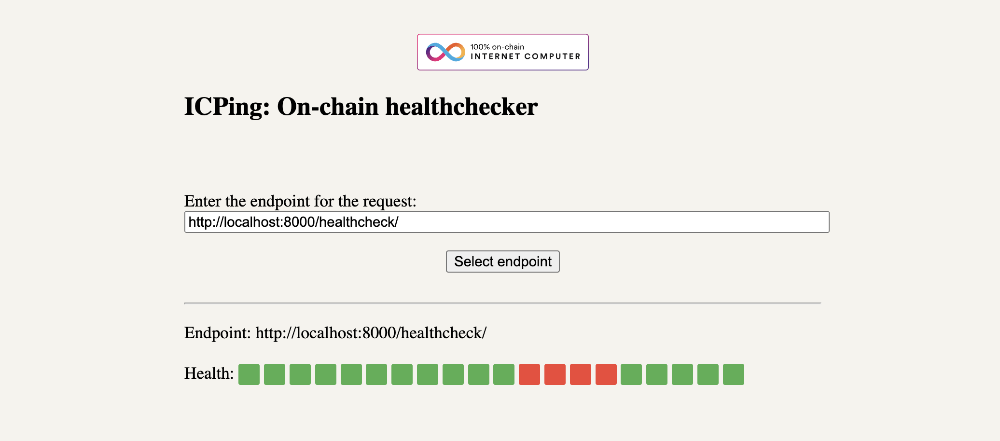

# `icping`: The healthcheck canister

`icping` is a canister that you can deploy on the [Internet Computer](https://internetcomputer.org/)
and periodically ping an endpoint. This is used by the canister's frontend to
display the health status of the service running at that endpoint.

If the endpoint does not return a response, then the service is considered to
not be healthy (red rectangle) otherwise the service is considered healthy.

The ping interval is set to `5` seconds and can be customized by updating the
`interval` variable of the canister in `src/icping_backend/main.mo`.

See a sample image of running the canister on the localhost:

## How to run

You can run the canister locally for future development by starting the local
IC network: `dfx start --clean`

And then deploy the canister with `dfx deploy`.

You can use [`mo-dev`](https://internetcomputer.org/docs/current/motoko/main/motoko-tools/mo-dev)
for hot reloading the changes to the canister and you can also run
`npm run start` to start the frontend only at `http://localhost:3000`.

## Architecture

The backend canister uses a `Timer` to setup a timer to make periodic `GET` requests
to the endpoint specified by the `url` variable. The results of the success
or the failure of the request are stored in a `Buffer` (currently only
the last 20 responses are stored, this can be changed before you deploy the
canister).

The frontend canister is allowed to set the `url` of the endpoint to ping. Then
retrieves the values stored in the backend canister buffer and displays the
status information as red/green rectangles.

## Future improvements

Currently the canister has many limitation. Some necessary future improvements:
- Access control: Add access control to allow only the controller(s) of the
canister to update the `url` of the endpoint to be pinged. The retrieved data
should also be private to the controller(s) only and the frontend application
should handle that use case.
- Response processing: Process the response from the endpoint to look for
specific patterns that will count as a healthy response. For example look for
a pattern `{"status": "OK"}`.
- The response might contain additional information that can be used to collect
metrics and display them to the user.
- Use a secret token to send in the body of the `GET` request to allow only
users (and canisters) that know the secret to access the healthcheck endpoint.